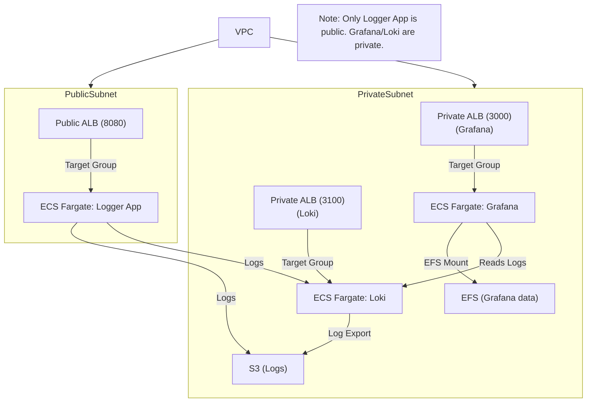

# Welcome to your CDK Python project!

This is a blank project for CDK development with Python.

The `cdk.json` file tells the CDK Toolkit how to execute your app.

This project is set up like a standard Python project.  The initialization
process also creates a virtualenv within this project, stored under the `.venv`
directory.  To create the virtualenv it assumes that there is a `python3`
(or `python` for Windows) executable in your path with access to the `venv`
package. If for any reason the automatic creation of the virtualenv fails,
you can create the virtualenv manually.

To manually create a virtualenv on MacOS and Linux:

```
$ python3 -m venv .venv
```

After the init process completes and the virtualenv is created, you can use the following
step to activate your virtualenv.

```
$ source .venv/bin/activate
```

If you are a Windows platform, you would activate the virtualenv like this:

```
% .venv\Scripts\activate.bat
```

Once the virtualenv is activated, you can install the required dependencies.

```
$ pip install -r requirements.txt
```

At this point you can now synthesize the CloudFormation template for this code.

```
$ cdk synth
```

To add additional dependencies, for example other CDK libraries, just add
them to your `requirements.txt` file and rerun the `pip install -r requirements.txt`
command.

## Useful commands

 * `cdk ls`          list all stacks in the app
 * `cdk synth`       emits the synthesized CloudFormation template
 * `cdk deploy`      deploy this stack to your default AWS account/region
 * `cdk diff`        compare deployed stack with current state
 * `cdk docs`        open CDK documentation

## Sample Python Logger Web App

A sample logger web app is provided in `app/sample_logger.py` that generates random logs and exposes a web endpoint. Each visit to `/` logs a timestamped message. The app is built with **FastAPI**.

### How to run locally

```bash
pip install -r requirements.txt
python app/sample_logger.py
```

Or run directly with uvicorn:

```bash
uvicorn app.sample_logger:app --host 0.0.0.0 --port 8080
```

Visit [http://localhost:8080](http://localhost:8080) in your browser.

### How to run in Docker

```bash
docker build -t logger-app .
docker run -p 8080:8080 logger-app
```

## Architecture

This project deploys a modern AWS logging and monitoring stack using ECS Fargate, ALB, EFS, S3, and FireLens. The architecture is as follows:

- **Logger App**: Runs as an ECS Fargate service, exposed via a public Application Load Balancer (ALB) on port 8080. Anyone can access it from the internet.
- **Grafana & Loki**: Both run as ECS Fargate services in private subnets, each behind a private/internal ALB (Grafana on 3000, Loki on 3100). They are not accessible from the public internet.
- **EFS**: Used by Grafana for persistent storage of dashboards and settings.
- **S3**: Used for log storage and backup.
- **FireLens**: Sidecar containers forward logs from ECS tasks to Loki and/or S3.
- **Security Groups**: Restrict access so only the ALB can reach the ECS services, and only ECS can reach EFS.
- **Flow**:
  - Users access the logger app via the public ALB.
  - Logger app generates logs and exposes a web endpoint.
  - Logs are sent to Loki and S3.
  - Grafana reads logs from Loki for visualization.
  - Only the logger app is public; Grafana and Loki are private.

## Architecture Diagram

See the full architecture below (render with a Mermaid plugin or VSCode extension):



## Deploying with GitHub Actions

 GitHub Actions workflow is provided to build, push, and deploy the logger app to ECS. Set the following secrets in your GitHub repository:
- `SERVER_CERT_ARN`
- `CLIENT_CERT_ARN`

The workflow will:
- Build and push the Docker image for the logger app
- Deploy the CDK stack (including ECS, ALBs, EFS, S3, etc.)
- Redploy the ECS service, using new task definitions

