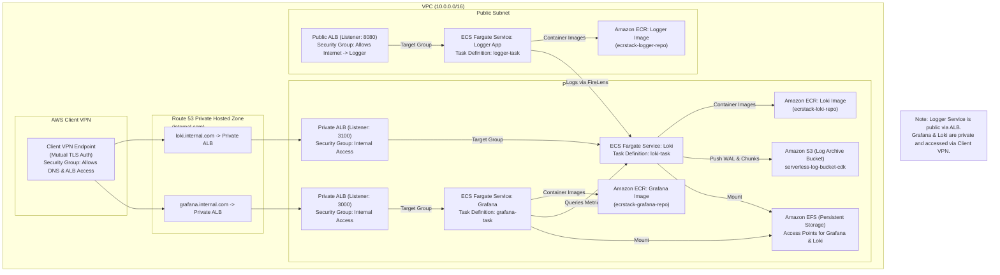

# Serverless Observability Platform powered by AWS CDK!

## Architecture Diagram
<br>
  
<br>


## Setup
To manually create a virtualenv on MacOS and Linux:

```
$ python3 -m venv .venv
```

After the init process completes and the virtualenv is created, you can use the following
step to activate your virtualenv.

```
$ source .venv/bin/activate
```

If you are a Windows platform, you would activate the virtualenv like this:

```
% .venv\Scripts\activate.bat
```

Once the virtualenv is activated, you can install the required dependencies.

```
$ pip install -r requirements.txt
```

At this point you can now synthesize the CloudFormation template for this code.

```
$ cdk synth
```

To add additional dependencies, for example other CDK libraries, just add
them to your `requirements.txt` file and rerun the `pip install -r requirements.txt`
command.

## Useful commands

 * `cdk ls`          list all stacks in the app
 * `cdk synth`       emits the synthesized CloudFormation template
 * `cdk deploy`      deploy this stack to your default AWS account/region
 * `cdk diff`        compare deployed stack with current state
 * `cdk docs`        open CDK documentation

## Sample Python Observability Web App

A sample observability web app is provided in `app/sample_logger.py` that demonstrates comprehensive monitoring capabilities. The app is built with **FastAPI** and includes:

- **Logging**: Structured logging with multiple severity levels
- **Metrics**: Custom business metrics and AWS service metrics
- **Tracing**: Distributed tracing with OpenTelemetry and AWS X-Ray
- **AWS Integration**: SQS message processing and DynamoDB operations
- **Health Checks**: Application health monitoring endpoints

### How to run locally

```bash
pip install -r requirements.txt
python app/sample_logger.py
```

Or run directly with uvicorn:

```bash
uvicorn app.sample_logger:app --host 0.0.0.0 --port 8080
```

Visit [http://localhost:8080](http://localhost:8080) in your browser.

### Available Endpoints

- `GET /` - Main endpoint with basic logging and metrics
- `GET /health` - Health check endpoint
- `GET /test-telemetry` - Test OpenTelemetry instrumentation
- `POST /send-message` - Send message to SQS queue
- `GET /receive-messages` - Receive messages from SQS queue
- `POST /save-data` - Save data to DynamoDB
- `GET /get-data/{data_id}` - Retrieve data from DynamoDB
- `GET /workflow` - Complete workflow (DynamoDB + SQS)

### How to run in Docker

```bash
docker build -t logger-app .
docker run -p 8080:8080 logger-app
```

## Architecture

This project deploys a comprehensive AWS observability platform using ECS Fargate, ALB, EFS, S3, OpenTelemetry, AWS X-Ray, and AWS Managed Prometheus. The architecture provides full observability with logs, metrics, and traces.

### Core Components

- **Logger App**: Runs as an ECS Fargate service with OpenTelemetry instrumentation, exposed via a public ALB on port 8080
- **Grafana**: Visualization platform running in private subnet, accessible via internal ALB on port 3000. To access Grafana, connection to Client VPN is required
- **Loki**: Log aggregation system running in private subnet on port 3100
- **AWS X-Ray**: Distributed tracing service for request flow analysis
- **AWS Managed Prometheus (AMP)**: Fully managed metrics storage and querying
- **SQS**: Message queuing for asynchronous processing
- **DynamoDB**: NoSQL database for application data storage
- **EFS**: Persistent storage for Grafana dashboards and configurations
- **S3**: Log archival and backup storage

### Observability Stack

- **Logs**: Structured logging via FireLens → Loki → Grafana
- **Metrics**: Custom metrics via OpenTelemetry → AMP → Grafana
- **Traces**: Distributed tracing via OpenTelemetry → X-Ray → Grafana
- **Security**: Container image scanning with Trivy and ECR scan-on-push

### Data Flow

1. **Application Layer**: Logger app generates logs, metrics, and traces
2. **Collection**: OpenTelemetry collector (ADOT) aggregates telemetry data
3. **Storage**: 
   - Logs → Loki (via FireLens)
   - Metrics → AWS Managed Prometheus
   - Traces → AWS X-Ray
   - Data → DynamoDB
   - Messages → SQS
4. **Visualization**: Grafana queries all data sources for unified dashboards
5. **Security**: Trivy scans container images for vulnerabilities

## Architecture Diagram(in mermaid)

See the mermaid architecture below:



## Security & Compliance

### Container Security
- **ECR Scan on Push**: Automatic vulnerability scanning for all container images
- **Trivy Integration**: GitHub Actions workflow scans for vulnerabilities on every push/PR
- **SARIF Upload**: Security findings are automatically uploaded to GitHub Security tab

### Security Features
- **Zero-Trust Architecture**: Private subnets for sensitive components
- **IAM Least Privilege**: Granular permissions for each service
- **Encryption**: Data encrypted in transit and at rest
- **Network Isolation**: Security groups restrict access between components

## Deploying with GitHub Actions

GitHub Actions workflow is provided to build, push, and deploy the observability platform to AWS. Set the following secrets in your GitHub repository:
- `SERVER_CERT_ARN`
- `CLIENT_CERT_ARN` 
- `ASSUME_ROLE_ARN`

The workflow will:
- Build and push Docker images for logger app, Grafana, and Loki
- Run Trivy security scans and upload SARIF results
- Deploy the CDK stack (ECS, ALBs, EFS, S3, AMP, X-Ray, SQS, DynamoDB)
- Redeploy ECS services with latest container images
- Configure observability data sources in Grafana

## Monitoring & Alerting

### Available Dashboards
- **Application Metrics**: Request rates, response times, error rates
- **Infrastructure Metrics**: CPU, memory, network utilization
- **Business Metrics**: Custom application metrics and KPIs
- **Distributed Traces**: Request flow analysis across services
- **Security Metrics**: Container vulnerability reports

### Alerting Capabilities
- **Grafana Alerts**: Configurable alerts based on metrics thresholds
- **AWS CloudWatch**: Native AWS monitoring and alerting
- **X-Ray Insights**: Automatic anomaly detection for traces

